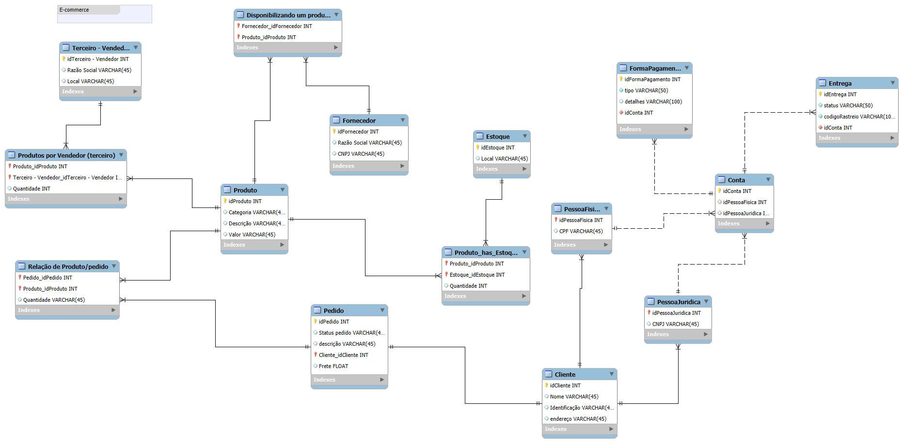

# 📦 Projeto de Banco de Dados - E-commerce

Este projeto apresenta a modelagem de um banco de dados relacional para uma plataforma de e-commerce, desenvolvida no MySQL Workbench.

A modelagem contempla os principais elementos de um sistema de vendas online, como cadastro de clientes PF e PJ, controle de pedidos, produtos, fornecedores, estoque, formas de pagamento e status de entrega.

---

## 🎯 Objetivos

- Diferenciar clientes Pessoa Física (CPF) e Pessoa Jurídica (CNPJ), de forma exclusiva
- Permitir múltiplas formas de pagamento por pedido
- Controlar status e código de rastreio das entregas
- Relacionar produtos com fornecedores, estoques e pedidos

---

## 🗃️ Principais Tabelas

- `Cliente`, `Cliente_PF`, `Cliente_PJ`
- `Produto`, `Fornecedor`, `Produto_has_Estoque`
- `Pedido`, `Entrega`
- `FormaPagamento`, `Pedido_has_FormaPagamento`
- `Relacao_Produto_Pedido`
- `Terceiro_Vendedor`

---

## 💡 Tecnologias

- MySQL
- MySQL Workbench (EER Diagram)
- SQL

---

## 🖼️ Diagrama

---

